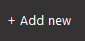

# Introduction
In this lab we will be exploring the data available our query from the previous lab.

## Pre-requisites
- Complete the Getting Started lesson 

## Lab Objective
- Use the Add Query feature of Docs to produce a value of report
- Filter for a single interaction
- Observer the data values available along with their definitions 
  
## Add Query from Docs
<button onclick="vidPop('d2c7b761-9291-40ec-b76f-3cb25c657c83')">Launch Video</button> 

1.  

Click + Add new in the top bar of Altair 

     
         

3.  Docs Panel 

<!-- ---

### testing section

<button onclick="vidPop('d2c7b761-9291-40ec-b76f-3cb25c657c83')">Launch Video</button>

<button onclick="vidPop('483abf7f-d623-49fe-a1f6-ea2fcb082763')">Launch Video 2</button> -->